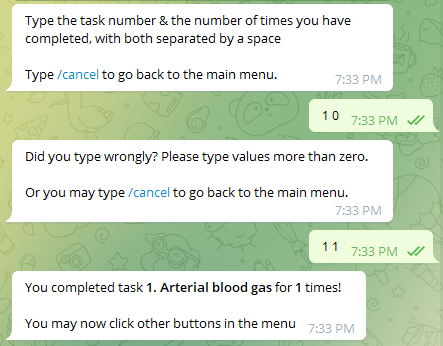
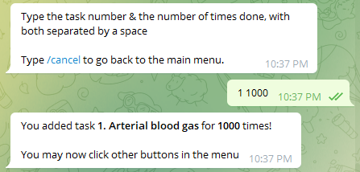
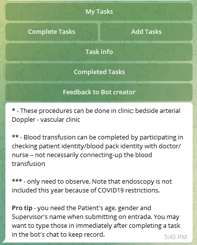
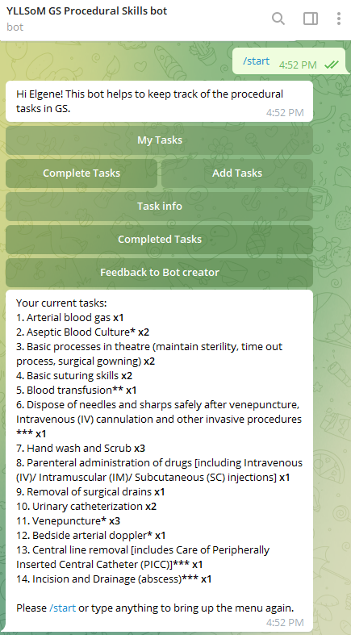
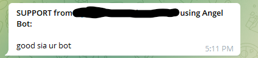
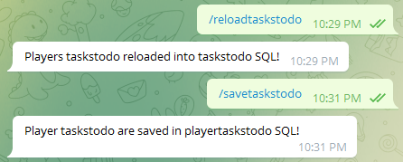

# yeozhenhao's tasks bot for NUS Medicine GS Posting
## Features
- Keep track of the Procedural Skills you have done during your
General Surgery posting in NUS Medicine!
  - Keeps track of completion of tasks
\
***Completing tasks. The number of times completed must be an integer >0. Type the Task no. followed by the number of times you've completed the task.***
  - Keeps track of adding more tasks
\
***Adding tasks. The add value must be an integer >0. Type the Task no. followed by the number of times you want to add to the task.***
- Shows you extra information for some of the tasks
\
***See the Tasks info within the bot!***
- Shows you the number of tasks to be done, specific to each user (as user data are stored in a PostgreSQL database)
\
***Starting the bot & clicking "My Tasks" button will show you the tasks to do.***
- As in my Angels & Mortals bot, users can send support messages by clicking "Feedback to Bot creator" if the tasks change in a few years later (set by NUS)
and the tasks list in the bot needs to be updated
\
***SUPPORT message sent to Bot creator (set by chat id) within the bot whenever a feedback is submitted***
- As in my Angels & Mortals bot, the Bot creator (set by chat id) can use a few commands (shown below) just in case any issue arises. But they are not essential in running of the bot. 
\
***Commands that can be used by the Bot creator. Anyone else using the command will be denied by the bot.***
**Avaiable commands:**
> /downloadtaskstodo - downloads taskstodo SQL database into local CSV\
> 
> /savetaskstodo - uploads data from bot into taskstodo SQL database\
>
> /reloadtaskstodo - uploads data from local JSON into taskstodo SQL database

## About this project
- This bot was hosted on Heroku server and connected to a PostgreSQL database to save the
data for each user after the bot goes to sleep on Heroku

- coded SQL language to enable updating of the user data on PostgreSQL database

- The tasks required & tasks information were taken from the official Procedural Skills document sent
by NUS Medicine to all students in the General Surgery posting.
- This project is **not** endorsed in any form by NUS Medicine. This is a personal project
to help the student community.
- To save time, the code in this project was modified from [Angel and Mortals Dual Telegram Bots](https://github.com/yeozhenhao/Angels_Mortals_bot).
Thus, the names of the functions in the Python code may look unusual.